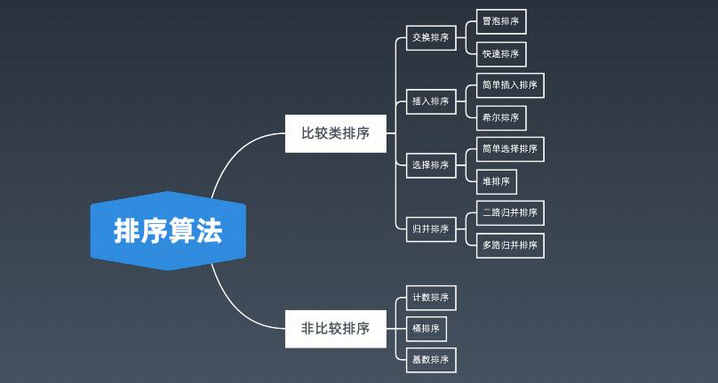
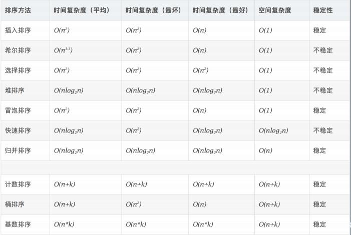

# 排序算法

主要分为两类：

**比较类排序**：

通过比较来决定元素间的相对次序，由于其时间复杂度不能突破 

O(nlogn)，因此也称为非线性时间比较类排序。 

**非比较类排序**：

不通过比较来决定元素间的相对次序，它可以突破基于比较排序的时

间下界，以线性时间运行，因此也称为线性时间非比较类排序。

 

最值得学习的首先是比较类排序，因为它才是工业编程上用的最多的，其中以时间复杂度nlogn的为主。非比较类排序一般需要对象是整型类数据，以及辅助用额外的内存空间，所以我们主要学习的是 

快排，归并，堆排序。 手写  ，原理。

初级排序 - O(n^2)

1. 选择排序（Selection Sort） 

每次找最小值，然后放到待排序数组的起始位置。

2. 插入排序（Insertion Sort） 

从前到后逐步构建有序序列；对于未排序数据，在已排序序列中从后

向前扫描，找到相应位置并插入。

3. 冒泡排序（Bubble Sort） 

嵌套循环，每次查看相邻的元素如果逆序，则交换。